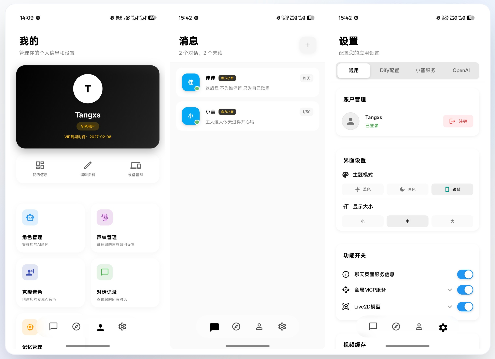
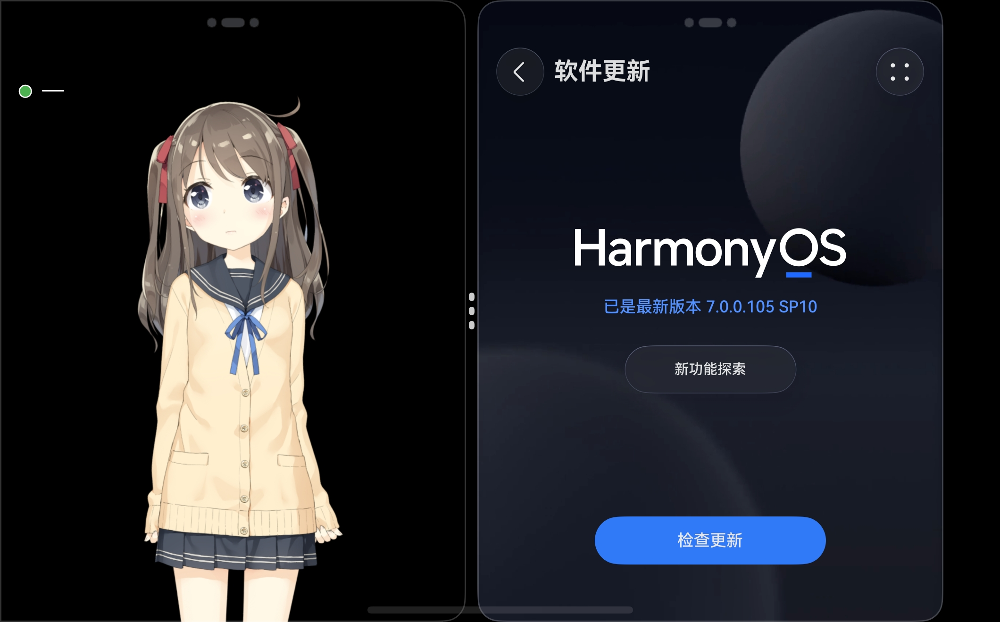

  <a href="./README.md">中文</a> | 
  <a href="./README_EN.md">English</a> | 
  <a href="./README_VI.md">Tiếng Việt</a> |
  <a href="./yuandan-update.md">元旦更新</a>

<h1 align="center">小智 AI 助手 · 全端客户端</h1>

  <b>Android · iOS · HarmonyOS · Web · Windows · macOS · Linux</b> 
  基于小智AI的实时语音对话应用 · 支持实时语音交互与文字对话

  
  
  
  
  

> **🎉 新版本已发布，敬请体验！**
> Flutter iOS 与 Android 回音消除已实现，~~欢迎大家 PR~~。
> Dify 支持发送图片交互，可添加多个小智智能体到聊天列表。
> 觉得项目对您有用的，可以赞赏一下 —— 您的每一次赞赏都是我前进的动力。

---

## 📌 版本导览

<table>
  <tr>
    <!-- 左侧卡片 -->
    <td align="center" valign="top" style="padding-right: 20px;">
      <table>
        <tr>
          <td align="center" valign="middle" height="300">
            
          </td>
        </tr>
        <tr>
          <td align="center" valign="top">
            <small>
              可自行打包APK、IOS、WEB、PC、鸿蒙 HAP 版本 
              <a href="https://www.bilibili.com/video/BV1fgXvYqE61" style="color: red; text-decoration: none;">观看 demo 视频点击跳转</a>
            </small>
          </td>
        </tr>
      </table>
    </td>
    <td align="center" valign="top">
      <table>
        <tr>
          <td align="center" valign="middle" height="300">
            
          </td>
        </tr>
        <tr>
          <td align="center" valign="top">
            <small>
              V1 原生客户端 · 纯血鸿蒙 &nbsp;
            </small>
          </td>
        </tr>
      </table>
    </td>
  </tr>
</table>

当前项目包含两条产品线，定位不同，可按场景选择：

- **🟦 V1 原生客户端 · 纯血安卓 + 纯血鸿蒙（商业版赠送）**  
  面向 **AI 终端 / AI 硬件 / 智能体方向**，包含两个原生版本：**纯血安卓版**、**纯血鸿蒙版**。购买商业版即可获赠。

- **💼 V3 商业版 · 全功能跨平台客户端**  
  基于 Flutter，覆盖 Android、iOS、HarmonyOS、Web、Windows、macOS、Linux，**也适配鸿蒙，支持编译 HAP 包**。主打 **全功能、全平台**，深度适配自研服务端。

---

## 🟦 V1 原生客户端 · 纯血安卓 + 纯血鸿蒙（商业版赠送）

> **推荐场景：AI 终端设备 · AI 硬件产品 · 智能体设备 · 折叠屏 / 副屏设备**
>
> 购买商业版即可获赠 V1 原生客户端，包含两个原生版本：
>
> - **纯血安卓版** — 基于 Android 原生开发，适配安卓手机、平板、折叠屏及各类安卓 AI 硬件。
> - **纯血鸿蒙版** — 基于 HarmonyOS NEXT 原生开发，适配鸿蒙生态设备、折叠屏、副屏设备。

<b>📱 原生体验</b>

- ✅ **纯血安卓 + 纯血鸿蒙** — 两个版本均为原生开发，不做套壳，启动快、功耗低、体验顺滑
- ✅ **折叠屏适配** — 展开态 / 折叠态双布局自适应，展开大屏充分释放信息密度
- ✅ **副屏适配** — 副屏卡片与主屏联动，与折叠屏、双屏设备更搭配
- ✅ **商业版服务端适配** — 与 V3 共用同一套商业版服务端能力

<b>🤖 AI 终端 / AI 硬件 / 智能体能力</b>

- ✅ **实时语音交互** — 实时语音对话与文字对话，支持实时打断
- ✅ **多小智服务** — 支持添加多个小智服务，轻松实现每人多助手
- ✅ **硬件端互通** — 可与硬件端互通，记忆不串
- ✅ **IoT 控制** — 支持调用设备功能，适合作为 AI 终端中控
- ✅ **智能体方向扩展** — 可结合小智后端能力，扩展为面向 AI 硬件的智能体入口

<b>🧩 适合的 AI 硬件形态</b>

- AI 桌面终端 / AI 音箱
- AI 学习机 / AI 陪伴设备
- 鸿蒙折叠屏手机 / 平板
- 带副屏的 AI 硬件设备
- 智能体中控屏 / 家庭 AI 终端

---

## 💼 V3 商业版 · 全功能跨平台客户端

> **推荐场景：全功能手机客户端 · 全平台覆盖 · 办公大屏 · 需要完整商业功能的场景**
>
> 基于 Flutter 框架，一套代码覆盖 Android、iOS、HarmonyOS、Web、Windows、macOS、Linux，深度适配自研服务端。
> **V3 也适配鸿蒙，支持编译 HAP 包。**

<b>📱 平台与适配</b>

- ✅ **全平台覆盖** — Android / iOS / HarmonyOS / Web / Windows / macOS / Linux
- ✅ **鸿蒙适配** — 支持编译 HAP 包，可运行于 HarmonyOS
- ✅ **回音消除** — Flutter iOS 与 Android 回音消除已实现
- ✅ **商业版服务端适配** — 深度适配自研服务端

<b>🎨 交互体验</b>

- ✅ **自适应主题** — 深色 / 浅色主题适配，跟随设备自动切换
- ✅ **创新性心情模式** — 支持实时打断模式
- ✅ **语音实时打断** — 小智说话期间可随意打断，说您想说无人能挡
- ✅ **OpenAI 测速** — OpenAI 接口响应测速，服务快不快一眼可见

<b>🧠 AI 能力</b>

- ✅ **AI 服务提供商** — 支持 OpenAI 等服务，手机上也能用大模型
- ✅ **思考模式** — 支持 OpenAI 思考模式
- ✅ **OpenAI 接口联网搜索** — 支持 OpenAI 接口服务联网搜索
- ✅ **HTML 代码预览** — 模型写简单 HTML 代码即可预览，手机也能 AI 编程
- ✅ **MCP_Client** — 支持 MCP 能力调用，接口数据都能 DIY
- ✅ **视频播放** — 支持播放模型返回的视频
- ✅ **Live2D** — 多模型切换，支持导入自己心爱的模型人物

<b>🔗 连接与协议</b>

- ✅ **WS** — 支持 WS 协议服务
- ✅ **MQTT-UDP** — 支持 MQTT 协议服务，长连接
- ✅ **多小智服务** — 添加多个小智服务，轻松实现每人多助手
- ✅ **打通硬件端** — 可与硬件端互通，记忆不串
- ✅ **IoT** — 支持调用手机功能、导航、听歌等

<b>👤 账号与数据</b>

- ✅ **用户信息** — 展示会员到期时间、对话数量、绑定设备数量、声纹数量、配额使用情况、最近活动设备
- ✅ **设备管理** — 手机端查看当前登录用户的所有设备、新增设备
- ✅ **角色管理** — 手机端管理当前角色、新建角色
- ✅ **声纹管理** — 手机端录制声纹，让您的 AI 更懂您
- ✅ **对话记录** — 支持展示最近的对话记录
- ✅ **记忆管理** — 支持展示记忆
- ✅ **预留页面** — 预留记账、待办、日记等页面 UI，可集成小智后端能力扩展

---

## 🖥 服务端 商业版功能

| 功能模块 | 状态 | 描述 |
|:---|:---:|:---|
| **首句响应** | ✅ | 唤醒词响应时间 < 1 秒，极速响应体验 |
| **平均响应速度** | ✅ | 平均对话响应时间 < 2 秒（公网 CDN 网络），本地内网极限 800ms 内 |
| **MQTT 协议** | ✅ | 支持 MQTT 通信协议，长连接、服务端主动唤醒 |
| **音色克隆** | ✅ | 支持火山引擎音色克隆，实现个性化声音定制 |
| **声纹识别** | ✅ | 支持声纹识别功能，实现个性化语音助手 |
| **双向流式交互** | ✅ | 支持火山流式播放，实时语音输入和回复输出 |
| **用户端** | ✅ | 友好的用户端操作界面，原生卡片方式设备管理页面 |
| **MCP 接入点** | ✅ | 基于角色的 MCP 工具接入点，扩展功能接入（同步虾哥服务） |
| **MCP Hub 服务** | ✅ | SSE / HTTP MCP Hub，支持更多第三方服务集成 |
| **ESP32 设备主题自定义** | ✅ | 支持在线配置 ESP32 设备的主题、表情包 |
| **Function Call** | ✅ | 工具调用，提升用户体验 |
| **长期记忆** | ✅ | 根据用户对话提取关键信息记录，智能记忆管理 |
| **监控面板** | ✅ | 监控日、周、月不同维度 Token、对话时长、设备活跃等数据 |
| **OTA 固件升级** | ✅ | 固件上传，自动升级，远程设备管理 |
| **聊天数据可视化** | ✅ | 聊天频率统计图表等数据可视化功能，监控对话数据趋势 |
| **用户会员制** | ✅ | 支持按会员等级设置 Token 数，支持包月 / 年，在线支付（支付宝、微信、PayPal） |

---

## 📞 联系方式

| 渠道 | 信息 |
|:---|:---|
| **Email** | tang@lhht.cc |
| **WeChat** | Tang_xs-xk |
| **定制开发** | 支持提供定制化开发客户端，欢迎联系 WeChat |

### 服务端图形化部署工具

- <https://space.bilibili.com/298384872>
- <https://znhblog.com/>

---

## 🌟 支持

您的每一个 Star ⭐ 或赞赏 💖，都是我们不断前进的动力 🛸

  

---

## ⭐ Star History

